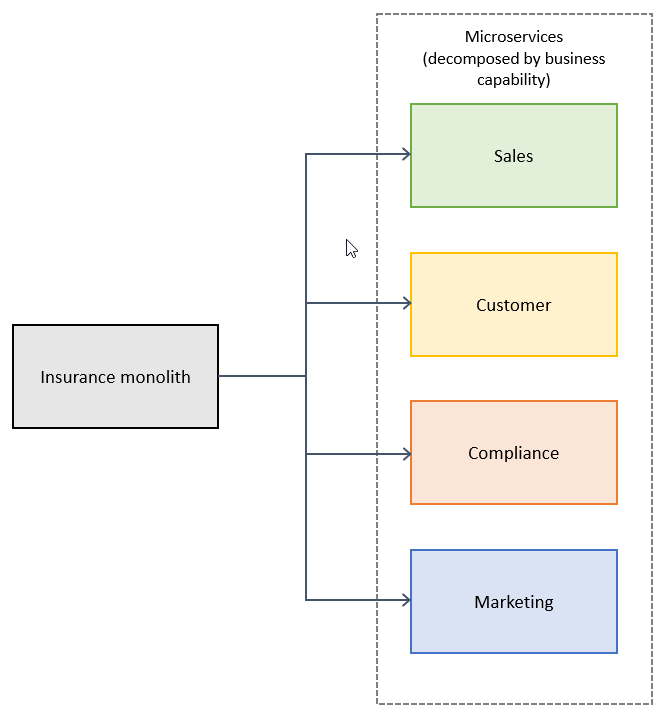
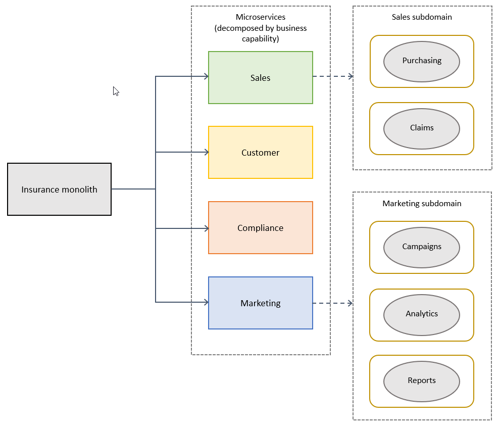

# 🏗️ Decomposition of a Monolithic Application to Microservices

La descomposición de una aplicación monolítica hacia una arquitectura de microservicios es uno de los pasos más críticos y complejos en una transformación cloud-native.  
Una descomposición adecuada mejora la agilidad, escalabilidad y mantenibilidad de la solución.

Aquí exploramos dos enfoques principales de descomposición: **por capacidades de negocio** y **por dominios/subdominios**.

---

## 🔹 Decomposition by Business Capability

**Business Capabilities** representan **lo que el negocio hace** en términos de funciones esenciales (por ejemplo: facturación, gestión de usuarios, inventario).

### Concepto
- Cada microservicio debe alinearse con una **capacidad de negocio independiente**.
- Los servicios son modelados para reflejar funciones de negocio, no estructuras técnicas.

### Aplicación de los 3 principios:
- **Alta Cohesión:** Cada servicio implementa funciones que pertenecen naturalmente a una única capacidad de negocio.
- **Responsabilidad Única (SRP):** Cada servicio cambia solo por cambios en su capacidad específica.
- **Bajo Acoplamiento:** Las capacidades están conectadas por APIs o eventos, minimizando dependencias técnicas directas.

### Ejemplo:
- Servicio de `Gestión de Pedidos`
- Servicio de `Facturación`
- Servicio de `Gestión de Usuarios`

Cada uno representa una **función completa e independiente** del negocio.

---

## 🔹 Decomposition by Domain / Subdomain (Domain-Driven Design)

Enfoque basado en **Domain-Driven Design (DDD)**, donde el sistema se modela alrededor de **dominios** y **subdominios**.

### Concepto
- **Core Domain:** Diferenciador competitivo del negocio. **Debe ser priorizado.**
- **Supporting Domain:** Soporta el Core Domain pero no es crítico por sí mismo.
- **Generic Domain:** Funciones genéricas (por ejemplo, autenticación) que pueden ser externalizadas.

### Ejemplo:
En una plataforma de e-commerce:
- **Core Domain:** Gestión de catálogo de productos.
- **Supporting Domain:** Procesamiento de pagos.
- **Generic Domain:** Autenticación de usuarios.

Cada subdominio puede convertirse en uno o varios microservicios.

---

## 📊 Tabla Comparativa

| Aspecto | Business Capability | Domain/Subdomain |
|:---|:---|:---|
| Enfoque principal | Funciones del negocio | Modelado de dominio de negocio |
| Nivel de granularidad | Alto nivel funcional | Más profundo y técnico |
| Uso de DDD | Opcional | Fundamental |
| Alineación con equipos | Equipos por capacidad de negocio | Equipos por subdominio |
| Ideal para | Empresas que necesitan agilidad rápida basada en funciones | Sistemas complejos con alta especialización de dominios |

---

## 🎯 Conclusión

- **Descomponer por Business Capabilities** es más accesible y rápido en organizaciones que buscan resultados ágiles inmediatos.
- **Descomponer por Domain/Subdomain** proporciona un modelo más sólido y sostenible en organizaciones con dominios de negocio complejos.
- Muchas migraciones exitosas combinan ambos enfoques de forma progresiva.

> 🔥 **Consejo práctico:** Empieza identificando capacidades de negocio claras y, a medida que el sistema evoluciona, refina hacia una separación más orientada a subdominios.

---

[Anterior](https://github.com/wilfredoha/microservices-event_driven-architecture/blob/main/01_Migration_to_Microservices/01_microservices_boundaries.md)   [Siguiente](https://github.com/wilfredoha/microservices-event_driven-architecture/blob/main/01_Migration_to_Microservices/03_migration_steps_tips_patterns.md)

[Menú Principal](https://github.com/wilfredoha/microservices-event_driven-architecture)