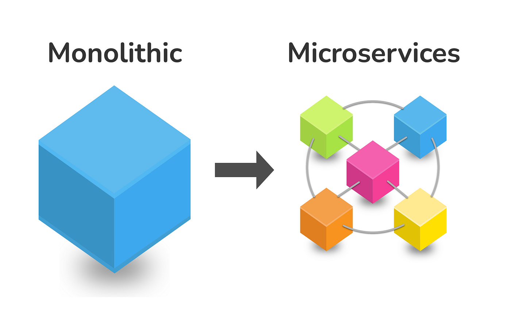

# 🚀 Migration to Microservices - Steps, Tips and Patterns

La migración de un monolito a una arquitectura de microservicios es un proceso desafiante que requiere una estrategia sólida para minimizar riesgos y asegurar el éxito.

A continuación, exploramos enfoques de migración, preparación recomendada y patrones que ayudan a realizar una transición controlada y efectiva.

---

## 🛤️ ¿Dónde comenzar la migración?

Existen dos enfoques principales para iniciar la migración:

### 🔥 Big Bang Approach

**Descripción:**  
Reescribir o dividir todo el monolito de una vez para transformarlo en microservicios.

**Problemas:**
- Altísimo riesgo de fallos masivos.
- Grandes retrasos en la entrega de valor al negocio.
- Dificultad para probar todo el sistema nuevo.
- Costos impredecibles y tendencia a la fatiga de proyectos.

> ❌ **En general, se desaconseja este enfoque salvo en casos muy específicos.**

---

### 🌱 Incremental and Continuous Approach

**Descripción:**  
Migrar **por partes**, extrayendo funcionalidades individuales del monolito a medida que se construyen microservicios nuevos.

**Beneficios:**
- Reducción del riesgo al mantener partes del sistema funcionales en producción.
- Se entrega valor al negocio de manera continua.
- Permite adaptarse y aprender durante el proceso.

**Best Candidates para comenzar:**
- **Frequent Changes:** Funcionalidades que cambian constantemente.
- **High Scalability Requirements:** Áreas que requieren escalar de forma independiente.
- **Least Technical Debt:** Módulos con menor acoplamiento y dependencias internas.

> ✅ **Este es el enfoque recomendado en la mayoría de los casos.**

---

## 🛠️ Prepararse para la migración

Antes de extraer funcionalidades a microservicios, es fundamental realizar ciertas acciones de preparación:

### 📈 Test Coverage
- Asegurar una **alta cobertura de pruebas** automatizadas.
- Permite detectar rápidamente problemas introducidos por cambios estructurales.

### 📜 Define Component API
- Definir contratos claros de comunicación para cada componente que se extraerá.
- Utilizar APIs bien documentadas garantiza la interoperabilidad.

### 🧹 Isolation (Removing Interdependencies)
- Eliminar dependencias innecesarias entre módulos.
- Asegurar que los componentes puedan funcionar **de manera independiente**.

---

## 🌳 Ejecutar la migración usando el Strangler Fig Pattern

**Strangler Fig Pattern** es una estrategia inspirada en cómo un árbol estrangulador crece alrededor de un árbol existente, eventualmente reemplazándolo.

**Aplicación en migración:**
- Rodear el monolito existente con nuevas funcionalidades implementadas como microservicios.
- Gradualmente redirigir tráfico y lógica del monolito a los microservicios.
- Eventualmente, el monolito "muere" cuando todas las funciones han sido reemplazadas.

> 📈 **Ventaja:** Permite una migración segura, controlada y reversible.

---

## 💡 Tip para asegurar una migración fluida

**Keep the Code and Technology Stack Unchanged**

- Durante la migración inicial, evita reescribir funcionalidades existentes o cambiar radicalmente el stack tecnológico.
- Mantén el mismo comportamiento y tecnologías lo más posible para reducir la complejidad.
- Cambios significativos deben realizarse después de que el microservicio haya sido extraído y estabilizado.

> 🎯 **Prioriza la separación de responsabilidades y la arquitectura limpia antes que la modernización tecnológica.**

---

## 🧠 Resumen

Migrar de un monolito a microservicios es una maratón, no una carrera de velocidad.  
Al enfocarse en un enfoque incremental, preparar adecuadamente el terreno, utilizar patrones como **Strangler Fig** y minimizar los cambios técnicos innecesarios, se puede lograr una transición segura, efectiva y sostenible.

---

[Anterior](https://github.com/wilfredoha/microservices-event_driven-architecture/blob/main/01_Migration_to_Microservices/02_decomposition_monolith.md)   [Siguiente](https://github.com/wilfredoha/microservices-event_driven-architecture/blob/main/02_Microservices_Principles/01_databases_microservices.md)

[Menú Principal](https://github.com/wilfredoha/microservices-event_driven-architecture)