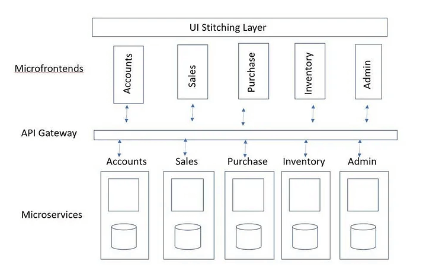

# 🧱 Micro-Frontends Architecture Pattern

El patrón de micro-frontends extiende los principios de los microservicios al frontend. Permite dividir una aplicación frontend monolítica en partes independientes, cada una mantenida por un equipo diferente y desplegada de forma separada.

---

## 🧩 Problemas del Frontend Monolítico

Un **frontend monolítico** es una única base de código que representa toda la interfaz de usuario de la aplicación, fuertemente acoplada a múltiples servicios backend.

**Principales desventajas:**

- **🔄 Ciclos de prueba más largos:** incluso cambios menores requieren pruebas completas del sistema.
- **🔗 Acoplamiento fuerte:** los desarrolladores frontend están estrechamente ligados a los equipos de backend, dificultando la independencia.
- **📦 Mantenimiento complejo:** la base de código crece con el tiempo, haciéndose más difícil de entender y mantener.
- **🚧 Cada cambio requiere:**
  - Reconstrucción completa del frontend.
  - Retesting total.
  - Redeployment de toda la aplicación, aunque el cambio sea menor.

---

## 🧱 ¿Qué es Micro-Frontends?

Los **micro-frontends** son una arquitectura donde el frontend está dividido en múltiples aplicaciones pequeñas, cada una encargada de una funcionalidad específica del sistema.

### 🔨 ¿Cómo se implementa?

- Se parte el frontend monolítico en múltiples micro-frontends.
- Cada uno representa un dominio funcional (catálogo, pagos, perfil, etc.).
- Una **container application** se encarga de:
  - Renderizar elementos comunes (navegación, layout, autenticación).
  - Coordinar qué micro-frontend debe cargarse y cuándo.
  - Gestionar la carga dinámica de cada módulo.

> ⚠️ **Fuente común de confusión:**  
> Micro-frontends es un **patrón arquitectónico**, **no es un framework** ni un sistema de componentes reutilizables.

---

## ✅ Beneficios del Patrón Micro-Frontends

- **🧩 Reemplazo gradual de frontends complejos:** permite dividir y migrar progresivamente sin reescritura total.
- **👥 Propiedad full-stack por equipo:** cada equipo es dueño del frontend, backend y base de datos de su dominio funcional.
- **🔍 Pruebas más fáciles y rápidas:** se puede probar cada micro-frontend de forma aislada.
- **🚀 Pipelines separados:** cada micro-frontend tiene su propio CI/CD.
- **📅 Schedules de despliegue independientes:** los equipos pueden liberar versiones sin coordinar con toda la organización.

---

## 💡 Mejores Prácticas

- **📦 Cargar micro-frontends en tiempo de ejecución:** usando técnicas como Webpack Module Federation o carga dinámica por rutas.
- **🚫 No compartir estado global en el navegador:** cada micro-frontend debe manejar su propio estado local.
- **🔄 Comunicación entre micro-frontends:**
  - **Custom events**
  - **Callbacks**
  - **URL/address bar (query params, rutas)**

> 📌 La clave es mantener la independencia técnica y organizacional de cada micro-frontend mientras se conserva una experiencia de usuario coherente.

---

[Anterior](https://github.com/wilfredoha/microservices-event_driven-architecture/blob/main/02_Microservices_Principles/03_structured_autonomy.md)   [Siguiente](https://github.com/wilfredoha/microservices-event_driven-architecture/blob/main/02_Microservices_Principles/05_api_management.md)

[Menú Principal](https://github.com/wilfredoha/microservices-event_driven-architecture)