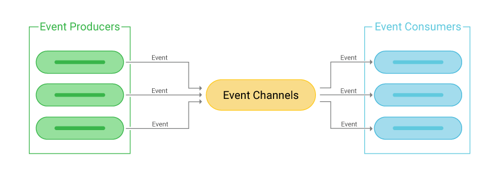

# ⚡ Introduction to Event-Driven Architecture

La arquitectura basada en eventos (**Event-Driven Architecture**, o EDA) es un estilo arquitectónico diseñado para construir sistemas altamente desacoplados, escalables y reactivos mediante la producción, detección, consumo y reacción a eventos.

---

## 🎯 Motivación para adoptar Event-Driven Architecture

Cuando no se utiliza EDA y se adopta un enfoque más tradicional (como llamadas HTTP entre servicios), se presentan diversos problemas:

- **Alto acoplamiento entre servicios:** cada servicio debe conocer la ubicación y API exacta del servicio al que necesita llamar.
- **Baja resiliencia:** si el servicio receptor está inactivo, la operación falla y puede interrumpir todo el flujo.
- **Escalabilidad limitada:** múltiples llamadas sincrónicas generan cuellos de botella bajo alta carga.
- **Complejidad para gestionar orquestaciones complejas:** manejar flujos distribuidos requiere lógica complicada.

EDA soluciona estos problemas permitiendo que los servicios se comuniquen de forma asincrónica mediante eventos, sin requerir conocimiento mutuo directo.

---

## 🧩 Fundamentos de la Arquitectura Basada en Eventos

### 📌 ¿Qué es un evento?

Un **evento** es una representación inmutable de un hecho que ocurrió en el sistema. Por ejemplo: *"Orden 123 fue pagada"*, *"Usuario 45 actualizó su dirección"*.

Características clave:
- **Inmutable:** una vez generado, no se modifica.
- **Persistente:** puede ser almacenado indefinidamente para auditoría o reprocesamiento.
- **Reutilizable:** múltiples consumidores pueden recibir y reaccionar al mismo evento.

### 👥 Participantes en EDA

1. **Productor de eventos (Event Producer):** componente o servicio que detecta un cambio de estado o acción significativa y genera un evento.
2. **Broker o intermediario de mensajes (Message Broker):** sistema que recibe, almacena temporalmente y distribuye los eventos. Ejemplos: Kafka, RabbitMQ, AWS SNS/SQS.
3. **Consumidor de eventos (Event Consumer):** componente que recibe y procesa eventos. Puede reaccionar, transformarlos, generar nuevos eventos o realizar acciones internas.

---

## 🔄 Modelo Request-Response vs Event-Driven

| Característica                  | Request-Response                            | Event-Driven                                 |
|--------------------------------|---------------------------------------------|-----------------------------------------------|
| Tipo de comunicación           | Sincrónica                                  | Asincrónica                                   |
| Acoplamiento                   | Alto (conocimiento directo entre servicios) | Bajo (desacoplado a través del broker)        |
| Control de flujo               | Cliente controla la ejecución               | Inversión de control (proceso impulsado por eventos) |
| Tolerancia a fallos            | Débil                                       | Alta (los eventos pueden ser reprocesados)    |
| Escalabilidad                  | Limitada                                    | Elevada                                       |

### 🧠 Inversión de Control

En el modelo tradicional, el **cliente inicia la acción** (request) y espera una respuesta. En EDA, los **consumidores reaccionan a eventos**, y el flujo es controlado por los datos que fluyen en el sistema, no por invocaciones directas.

---

## ✅ Conclusión

La arquitectura basada en eventos promueve una mayor **resiliencia**, **escalabilidad** y **desacoplamiento** en sistemas distribuidos. Al cambiar de un modelo sincrónico a uno asincrónico, los sistemas pueden evolucionar más fácilmente, manejar más carga, y adaptarse a flujos complejos sin generar dependencias rígidas entre componentes.

---

[Anterior](https://github.com/wilfredoha/microservices-event_driven-architecture/blob/main/02_Microservices_Principles/05_api_management.md)   [Siguiente](https://github.com/wilfredoha/microservices-event_driven-architecture/blob/main/03_Event_Driven_Architecture/02_use_cases_patterns.md)

[Menú Principal](https://github.com/wilfredoha/microservices-event_driven-architecture)