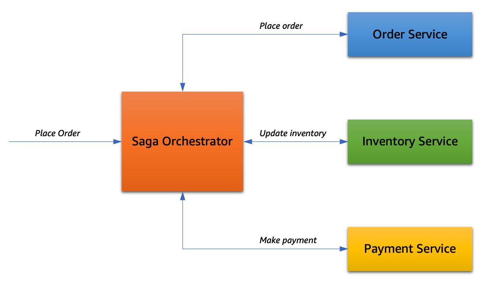
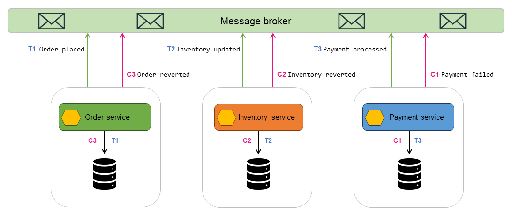

# 🧩 Saga Pattern

## ❗ Problema

En una arquitectura de **microservicios**, cada servicio gestiona su propia base de datos (principio de *Database per Microservice*), lo que imposibilita el uso de **transacciones ACID** tradicionales que abarcan múltiples servicios.

Esto genera el reto de mantener la **consistencia de los datos** entre servicios sin una transacción global. En sistemas monolíticos, una única transacción ACID podía garantizar atomicidad, consistencia, aislamiento y durabilidad. En cambio, en arquitecturas distribuidas, se necesita una estrategia alternativa para coordinar múltiples transacciones locales.

---

## 💡 ¿Qué es el Saga Pattern?

El **Saga Pattern** es una solución para manejar **transacciones distribuidas** en arquitecturas de microservicios. En lugar de una única transacción global, una saga se compone de una **serie de transacciones locales** en distintos servicios. Cada transacción local actualiza su propia base de datos y publica un evento o invoca el siguiente paso de la saga.

Si una de las transacciones falla, se ejecutan **operaciones compensatorias** para revertir las anteriores y mantener la consistencia eventual del sistema.

Una saga puede entenderse como una coreografía de pasos independientes pero coordinados, donde cada paso debe ser:
- **Idempotente** (para tolerar repeticiones).
- Acompañado de una **acción compensatoria** en caso de fallas.

---

## 🔁 Formas de Implementación

### 1. 🧭 Orquestación basada en Workflow

Un servicio central, denominado **orquestador**, controla la ejecución completa de la saga:

- Llama de forma secuencial a los servicios participantes.
- Espera confirmación de cada paso antes de continuar.
- Si ocurre una falla, ejecuta directamente las acciones compensatorias correspondientes en orden inverso.

**Ventajas:**
- Mayor visibilidad y control del flujo.
- Simplicidad para trazar y depurar errores.

**Desventajas:**
- Introduce acoplamiento con el orquestador central.
- Mayor dependencia de una única pieza de coordinación.

---

### 2. 🔄 Coreografía basada en Eventos

En este modelo **descentralizado**, no existe un orquestador. Cada servicio:
- Escucha eventos emitidos por otros servicios.
- Ejecuta su transacción cuando detecta el evento correspondiente.
- Emite un nuevo evento indicando el resultado, que puede ser escuchado por otros servicios.

**Ventajas:**
- Bajo acoplamiento entre servicios.
- Arquitectura más resiliente y escalable.

**Desventajas:**
- Dificultad para rastrear y depurar el flujo de eventos.
- Aumenta la complejidad del sistema distribuido.

---

## ✅ Conclusión

El Saga Pattern permite manejar la consistencia en sistemas distribuidos donde no se pueden utilizar transacciones ACID tradicionales.  
Aunque no garantiza consistencia inmediata, proporciona una forma segura y confiable de mantener la integridad de los datos mediante **consistencia eventual**.

La elección entre **orquestación** y **coreografía** dependerá del nivel de control, simplicidad operativa y escalabilidad que se desea alcanzar en el sistema.

---

[Anterior](https://github.com/wilfredoha/microservices-event_driven-architecture/blob/main/03_Event_Driven_Architecture/04_message_broker_technologies.md)   [Siguiente](https://github.com/wilfredoha/microservices-event_driven-architecture/blob/main/04_Event_Driven_Patterns/02_cqrs_pattern.md)

[Menú Principal](https://github.com/wilfredoha/microservices-event_driven-architecture)